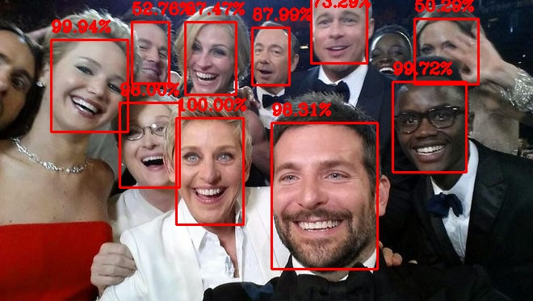

# Face Detection

## Face Detection with OpenCV Caffemodels, MTCNN, Blazeface, and YOLOv5-face



## Setup

Inside a virtual environment:

```bash
# install requirements for all face detection models
$ pip install -r requirements.txt
# install model specific requirements
$ pip install -r face_detection_and_extraction/requirements/age_gender_training.txt
$ pip install -r face_detection_and_extraction/requirements/face_detection_trt_server.txt
$ pip install -r face_detection_and_extraction/requirements/mobile_facenet.txt
$ pip install -r face_detection_and_extraction/requirements/blazeface.txt
$ pip install -r face_detection_and_extraction/requirements/mtcnn.txt
$ pip install -r face_detection_and_extraction/requirements/opencv.txt
$ pip install -r face_detection_and_extraction/requirements/openvino.txt
$ pip install -r face_detection_and_extraction/requirements/yolov5-face.txt
```

## Face Detection Models Implemented

CPU Performance recorded on a MacBook Pro with a **2.4 GHz 8-Core Intel Core i9** processor and **16 GB 2400 MHz DDR4** memory with no intensive programs running in the background on a video (**original resolution 576x1024**) with two detectable faces.

| Model                   |          FPS         | <center>Types</center>                                                |          <center>Supported</center>         |
| :---------------------- | :------------------: | :-------------------------------------------------------------------- | :-----------------------------------------: |
| blazeface               | 21 <br/> 16 <br/> 30 | front-camera pytorch <br/> back-camera pytorch <br/> back-camera onnx | :white_check_mark: <br/> :white_check_mark: |
| mtcnn                   |           2          | mtcnn from facenet                                                    |              :white_check_mark:             |
| opencv face-detection   |      18 <br/> 19     | caffemodel <br/> tensorflow graphdef                                  | :white_check_mark: <br/> :white_check_mark: |
| openvino face-detection |      25 <br/> 28     | MobileNetV2 + multiple SSD <br/> SqueezeNet light + single SSD        | :white_check_mark: <br/> :white_check_mark: |
| yolov5-face             |     13 <br/>  13     | yolov5s <br/> yolov5n                                                 | :white_check_mark: <br/> :white_check_mark: |
| arcface                 |         TODO         | arcface                                                               |             :white_large_square:            |

### Face Age and Gender Estimation

Performance recorded with same parameters as face-detection above.

| Model  | FPS | Types                |      Supported     |
| :----- | :-- | :------------------- | :----------------: |
| opencv | 12  | Age and Gender Model | :white_check_mark: |

## Face Detection and Extraction

Instructions inside `face_detection_and_extraction` for face detection in images, video, and webcam feed along with face extraction from a dataset of images.

## Face Feat Extraction and Filtering for faces of the same person

Instructions inside `face_feat_extraction_and_filtering` for face feat extraction and face similarity extraction.

### Acknowledgements

-   (YOLOv5-face)[https://github.com/deepcam-cn/yolov5-face]
-   (Face Age Gender Training)[https://github.com/tae898/age-gender]
-   (learnopencv age and gender models)[https://github.com/spmallick/learnopencv]
-   (mtcnn)[https://github.com/ipazc/mtcnn]
-   (blazeface-python)[https://github.com/hollance/BlazeFace-PyTorch]
-   (openvino-open_model_zoo)[https://github.com/openvinotoolkit/open_model_zoo]
-   (image orientation correction with DNNs)[https://d4nst.github.io/2017/01/12/image-orientation/]
-   (mobile facenet)[https://github.com/xuexingyu24/MobileFaceNet_Tutorial_Pytorch]
-   (face recognition embedding)[https://github.com/deepinsight/insightface/tree/master/model_zoo]
-   (face anti-spoofing)[https://github.com/kprokofi/light-weight-face-anti-spoofing]
